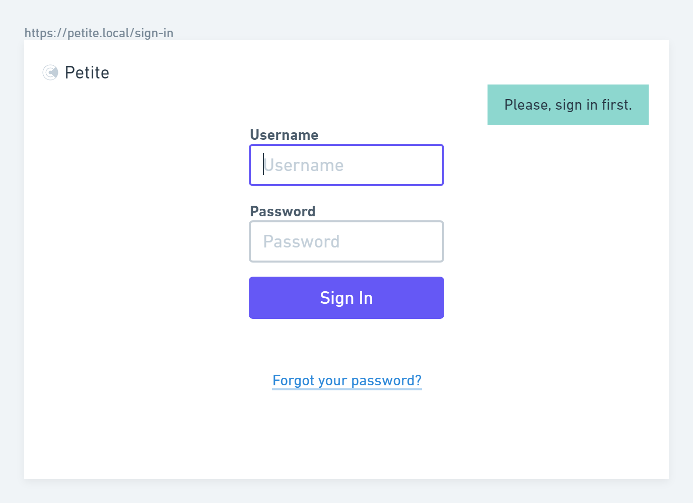
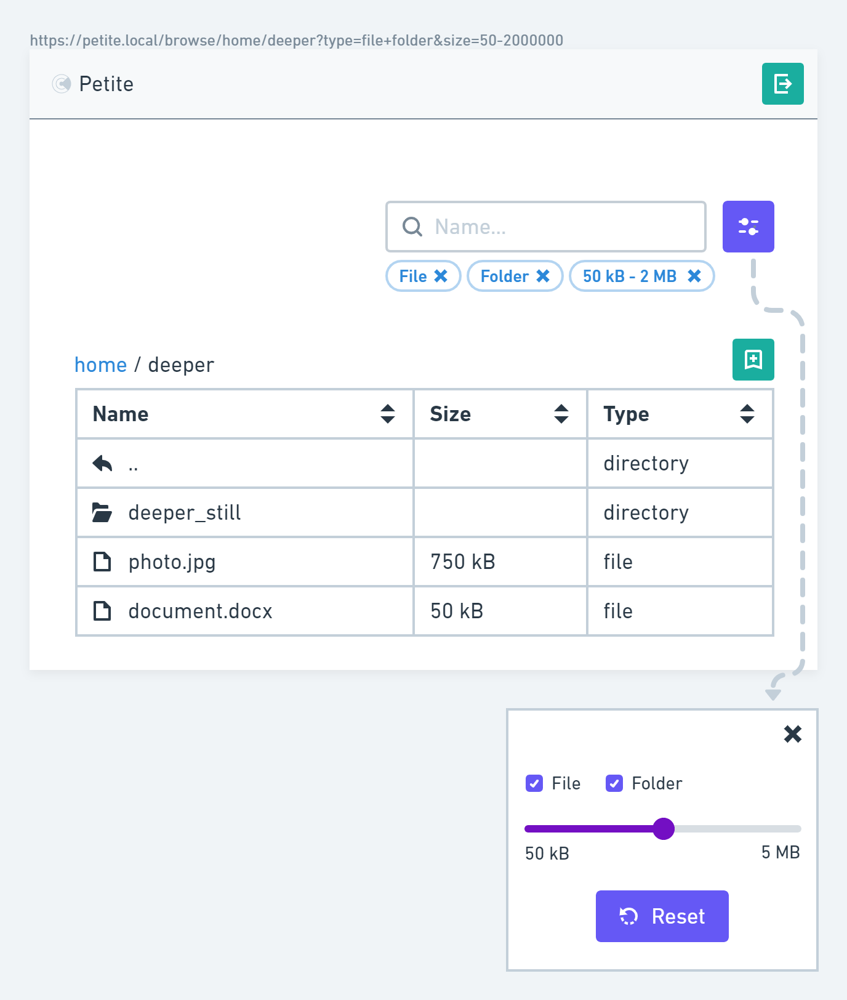

# Frontend Challenge: Design Doc

This is a design document for the [frontend challenge](https://github.com/gravitational/careers/blob/main/challenges/frontend/challenge.md), a part of the interview process for a frontend position (Level 5) at Teleport, by [Tadeáš Peták](https://github.com/tadeaspetak).

It concerns the interview team and anyone else connected to the interview process. If you belong to neither group and still feel like reading on, it's nothing but joy to have you.

 1. [Context](#context)
 1. [Scope](#scope-goals--no-gos)
 1. [Wireframes](#wireframes)
 1. [Implementation Details](#implementation-details)
 1. [Timeline](#timeline)

# Context

Let's implement a web app which enables users to browse directory content on a server. The key elements of the application will be:

 - a file & directory browser with search and sorting (client-side)
 - authentication; the file tree is only accessible after signing in
 - API endpoints necessary for authentication purposes and for browsing a directory

# Scope: Goals & No-gos

This simple `app` shall empower users to:

 - sign in when not authenticated
 - view & browse directories
 - view metadata of a file (no preview)
 - sort and filter on all available attributes (`name`, `size`, and `type`)
 - bookmark URLs for quick navigation

On the backend, this entails a simple `server` which:
 
 - serves web assets
 - manages user sessions
 - returns contents of a directory on a given path

Finally, a few constraints and allowed/encouraged shortucts:

 - containerize the app (Docker)
 - use native browser API for networking
 - use native/standard libraries
 - store users & sessions in memory, no need for a db
 - feel free to hardcode usernames, hashes, or directory paths
 - make it secure (strong TLS, no web security vulnerabilities)

# Wireframes

_Note: Honestly, these are more colourful and specific than wireframes need to be — or maybe even should be — but it was too fast & easy with [Whimsical](https://whimsical.com) to do it any other way._


 

# Implementation Details

The entire codebase shall use typescript, reasonable linting, and be dockerized.

In a real app, error reporting would be done through an integration (like Sentry), but for the purposes of the challenge `console.error` will suffice. 

There will be a few tests for the key React components and for the key API endpoints, but coverage shouldn't become an obsession.

## Frontend

Let's use React (`create-react-app` for the simplicity of its setup), React Router, and Tailwind on the frontend. Core considerations:

 - **Authentication:** All protected routes will be wrapped in a simple component `<Protected />` which checks whether the user is authenticated. When they're not, the user is taken to the `/sign-in` page, and the original URL is stored in the `state` property on the `location` object of our router. That way, we can redirect the user back to where they intended to go once they've signed in.
 - **URL as the source of truth:** We will store user's current working directory inside the file tree as URL params, the sorting and filtering criteria as query params (`/browse/my-directory/my-child-directory?sort=name-up&search=holida`).
 - **Error handling**: Let's pay attention to loading states, errors (at the very least 400, 401, 403, 404, 500) and edge cases such as invalid filtering options, etc.
 - **Security:** Input and output shall be sanitised (URL params, query params, and the search input field).

## Backend

The server will be a plain `express` app. For the sake of simplicity, let's skip a database and store everything in memory instead.

Since searching and filtering is required on the client only, a handful of API endpoints will suffice:

 - `GET /contents?path={path}` to obtain 1-level deep contents of a directory, returning `{ contents: Item }` where `interface Item { name: string, sizeKb: number | undefined, type: "file" | "dir", items: undefined | Item[] }`
 - `POST /sign-in` to sign the user in
 - `POST /sign-out` to sign the user out (`POST` to avoid [prefetching it](https://twitter.com/nick_craver/status/296281730984316928?lang=fa) 🤦) 

## Security

_Note: Whenever generating random, secure tokens, let's use [crypto.randomBytes()](https://nodejs.org/api/crypto.html#cryptorandombytessize-callback)._

Security is, naturally, a huge consideration.

### TLS

To start with, let's use a self-signed certificate to enable `TLS` even on localhost. Unfortunately, this does imply you will need to import the certificate as trusted or "Accept the risk" in your browser. Cheers for your patience in advance 🙏

### Session Management

To avoid depending on external libs, we'll build a simple **session management** ourselves. On signing in, we generate a random `sessionId` for the user. This is used as the `key` in the `sessions` key-value store and also set as a cookie sent back to the client (`sameSite: lax`, `httpOnly: true`). (See more on security considerations in the [XSS](#cross-site-scripting-xss) and [CSRF](#cross-site-request-forgery-csrf) sections below.)

### Hashing Passwords

I will use `crypto.scrypt(password, salt, 64, { N: 16384 })` to compute the password hash, saving the salt alongside the result as a user property.

The salt needs to be there in order to prevent identical hashes of identical passwords, the work factor / iteration count / cost parameter (`N`) to make it even more difficult for an attacker to compute hashes of all possible passwords. `scrypt` uses `pbkdf2` internally, but makes higher demands on the memory necessary to compute the hash, making brute-force attacks even less rewarding.

### Directory Traversing

Since we'll be browsing real directories, we also need to make sure the user is not allowed outside their root directory. Let's use [path.normalize()](https://nodejs.org/api/path.html#pathnormalizepath) in the following way:

```
const whereabouts =  path.join(basePath, path.normalize(rawPath));
if (!whereabouts.startsWith(basePath)) return res.status(400);
```

### Cross-Site-Scripting (XSS)

Because we're not storing any user content and we are skipping file previews, Stored XSS is not an issue. Sanitising user input and output should take care of Reflected and DOM-Based XSS.

Since we won't be relying on any external resources, let's also write a strict Content Security Policy (CSP) to tighten things up.

Should a vector attack exist after all, we can mitigate this by storing the `sessionId` as an `httpOnly` cookie, making it unavailable to the client and, therefore, immune to being snatched by a third party.

### Cross-Site-Request-Forgery (CSRF)

Since CSRF exploits are applicable only with state-changing requests, we have a single candidate to protect, namely the `POST /sign-in` endpoint. To prevent the login flavour of CSRF, let's:

 - Disable `CORS`; in our case, this is the default behaviour.
 - Check the `Content-Type` header is set to `application/json` to prevent e.g. 3rd party forms from being submitted to our endpoint.
 - Set the `sameSite` attribute of our `sessionId` cookie to `lax` to prevent it from being sent on cross-site requests (with the exception of the "safe" `GET` and `HEAD` which should never be modifying state).

 The above combo 👆 should actually suffice, but we might as well implement token-based mitigation for good measure and practice:
 
  - Once the user hits the `sign-in` view, the client will ping the API to obtain a `csrfId` token via a cookie in the response (`sameSite: strict`). This token token will be sent alongside the credentials in the JSON body and checked against the one in the cookie to verify taht the `sign-in` request is being sent from our own site.

### Security in the Real World

In my estimation, these precautions should make our app pretty safe four our use case. In a real-world scenario, we would, naturally, need to consider the following and much more:

 - If files were to be viewed — not to mention uploaded — the `X-Content-Type-Options: nosniff` header should be set to prevent browser from MIME sniffing.
 - The app would be deployed, which would give us plenty of room for misconfiguration.
 - There would a database, i.e. lots of potential for SQL injections.
 - We would most likely be forced to use the `strict-dynamic` CSP since we would start loading external assets.

# Timeline

Ideally, this design document will be approved by Dec 3, and my PRs can start coming in. I will do my absolute best to have submitted the last PR by Wednesday, Dec 8.
